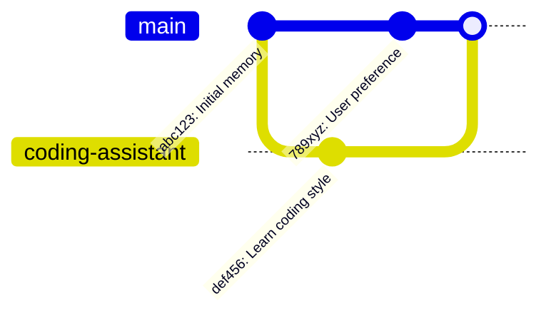

# Memory Architecture

> Git-like memory system for traceable, persona-aware, autonomous memory management.

## Academic Background

This architecture is inspired by the **Git Context Controller (GCC)** paper:

> **GCC: Git-based Contextual Controller for Autonomous LLM Memory Management**
> 
> arXiv: [https://arxiv.org/abs/2505.20787](https://arxiv.org/abs/2505.20787)

The GCC paper proposes using Git's data model for LLM memory, addressing key challenges:
- **Traceability**: How to track memory changes over time
- **Multi-persona**: How to maintain separate knowledge bases
- **Autonomous management**: How to let the LLM decide what to remember

### Our Implementation vs GCC Paper

| GCC Paper Concept | Our Implementation | Notes |
|-------------------|-------------------|-------|
| Event store | `EventLedger` (Layer 0) | SHA256 content-addressable |
| Branch model | `BranchManager` | Full merge/cherry-pick support |
| View materialization | `MemoryView` | Compute-on-demand |
| LLM controller | `MemoryController` | Prompt-driven extraction |
| Conflict resolution | `resolve_conflict()` | LLM-assisted merge |

### Differences from GCC

1. **Simplified hashing**: We use 16-char truncated SHA256 instead of full 40-char
2. **JSON storage**: We use JSON instead of Git object format for simplicity
3. **Integrated controller**: Our controller is tightly coupled with the agent loop
4. **No external Git dependency**: Pure Python implementation

## Overview

The nanobot memory system is inspired by Git's data model, providing:

- **Immutability**: All events are append-only, never modified or deleted
- **Traceability**: Full history of all memory operations with SHA256 hashes
- **Persona Isolation**: Different "personas" maintain separate memory branches
- **Autonomous Management**: LLM decides what to remember, forget, and when to switch personas
- **Human Readability**: JSON storage, Mermaid visualization, CLI commands

## Architecture Layers

```
┌─────────────────────────────────────────────────────────────────┐
│                     LLM Controller                              │
│   (Analyzes conversations, decides what to remember/forget)     │
├─────────────────────────────────────────────────────────────────┤
│                      Memory View                                │
│   (Materialized current state, like git working directory)     │
├─────────────────────────────────────────────────────────────────┤
│                    Branch Manager                               │
│   (Merge, cherry-pick, persona switching)                       │
├─────────────────────────────────────────────────────────────────┤
│                     Event Ledger                                │
│   (Immutable append-only log, content-addressable storage)     │
├─────────────────────────────────────────────────────────────────┤
│                    File System                                  │
│   workspace/memory/events/*.json, commits/*.json                │
└─────────────────────────────────────────────────────────────────┘
```

## Core Concepts

### 1. Memory Event

The atomic unit of memory. Each event records a single fact or observation.

```python
@dataclass
class MemoryEvent:
    event_type: Literal["add", "modify", "forget", "observe"]
    subject: str           # What or who this is about
    predicate: str         # The relationship or action
    object: str            # The value or target
    scope: Literal["permanent", "session", "temporary"]
    confidence: float      # 0.0 - 1.0
    source: str           # Where this came from
    evidence: str | None   # Supporting evidence
    sensitivity: Literal["normal", "private", "confidential"]
    parent_id: str | None  # For modifications/corrections
    timestamp: str         # ISO format
    id: str               # SHA256 hash (auto-computed)
```

**Event Types:**
- `add`: New information learned
- `modify`: Correction or update to existing memory
- `forget`: Explicit forgetting (soft delete)
- `observe`: Behavioral observation

### 2. Memory Commit

Groups related events into an atomic change (like a git commit).

```python
@dataclass
class MemoryCommit:
    branch: str           # Which persona/branch
    events: list[str]     # Event IDs included in this commit
    message: str          # Human-readable description
    parent_id: str | None # Previous commit (linked list)
    timestamp: str
    metadata: dict        # conversation_id, etc.
    id: str              # SHA256 hash
```

### 3. Memory Branch

Represents a persona or context with its own memory timeline.

```python
@dataclass
class MemoryBranch:
    name: str             # e.g., "main", "coding-assistant", "creative-writer"
    head: str | None      # Latest commit ID
    persona: str | None   # Description of this persona
    created_at: str
    metadata: dict
```

## Storage Structure

```
workspace/memory/
├── events/                    # Content-addressable event storage
│   ├── abc123def456.json     # Event files named by SHA256 hash
│   └── ...
├── commits/                   # Commit storage
│   ├── 789xyz000111.json     # Commit files named by hash
│   └── ...
├── branches.json             # Branch metadata
├── HEAD                      # Current branch pointer
└── MEMORY.md                 # Legacy human-readable summary
```

## Key Operations

### Recording Memory

```python
# LLM Controller analyzes conversation and decides what to remember
await memory_controller.process_conversation(messages, session_id)
```

The controller:
1. Extracts facts from conversation
2. Decides scope (permanent/session/temporary)
3. Checks for conflicts with existing memories
4. Creates events and commits

### Persona Management

```python
# Automatic persona detection
new_persona = await controller.maybe_switch_persona(conversation_context)

# Manual branch operations
store.create_branch("coding-assistant", persona="Technical helper for programming")
store.switch_branch("coding-assistant")
```

### Querying Memory

```python
# Get current memory view (materialized state)
memories = store.get_memory_view()

# Search across all memories
results = store.search("user preferences")

# Context for LLM
context_string = store.view.to_context_string()
```

### Branch Merging

```python
# Merge memories from another persona
conflicts = branch_manager.merge_branch("main", "temporary-project")

# Cherry-pick specific commit
branch_manager.cherry_pick(commit_id, "target-branch")
```

## CLI Commands

```bash
# View commit history
nanobot memory log
nanobot memory log --oneline

# List personas/branches
nanobot memory branches

# Show current memory state
nanobot memory view

# Generate visualization
nanobot memory graph
nanobot memory graph --format timeline

# Switch persona
nanobot memory checkout coding-assistant

# Create new persona
nanobot memory create-branch creative-writer --persona "Creative writing helper"

# Statistics
nanobot memory stats
```

## Visualization

The system can generate Mermaid diagrams for visualization:



## Autonomous Behavior

The LLM Controller makes these decisions automatically:

1. **What to Remember**: Extracts salient facts from conversations
2. **Scope Assignment**: Determines if memories are permanent/session/temporary
3. **Conflict Resolution**: Handles contradictions with existing memories
4. **Persona Detection**: Recognizes context shifts requiring different personas
5. **Memory Consolidation**: Periodically commits session observations

### System Prompt for Memory Analysis

The controller uses a structured prompt to extract memories:

```
Analyze this conversation and extract information worth remembering.

For each piece of information:
1. Decide the event type (add/modify/forget/observe)
2. Structure as subject-predicate-object triple
3. Assign scope (permanent/session/temporary)
4. Estimate confidence (0.0-1.0)
5. Note sensitivity level

Return JSON array of events to record.
```

## Design Principles

1. **Never Delete**: Events are immutable; forgetting is a new event
2. **Content-Addressable**: Same content = same ID = automatic deduplication
3. **Traceable**: Every memory has provenance (source, evidence)
4. **Persona-Aware**: Different contexts can have different knowledge
5. **Human-Readable**: JSON files, Mermaid graphs, Rich CLI output
6. **LLM-Driven**: The AI decides what matters, not explicit user triggers

## Future Extensions

- [ ] **Memory compression/summarization** for long histories
- [ ] **Cross-session memory migration**
- [ ] **Semantic search with embeddings** (like OpenClaw's LanceDB plugin)
- [ ] **memory_recall/memory_store tools** for LLM to explicitly query/save
- [ ] **Memory decay/importance scoring** for automatic pruning
- [ ] Memory export/import between instances
- [ ] Memory reflection and self-improvement

## Comparison with Other Systems

### vs OpenClaw (152k ⭐)

OpenClaw uses a simpler approach:
- `MEMORY.md` + `memory/YYYY-MM-DD.md` (Markdown files)
- Session compaction with pre-compaction memory flush
- Optional LanceDB vector search

**Nanobot advantages**:
- Git-style versioning (rollback, branches)
- Structured events (subject-predicate-object)
- Per-message automatic extraction

**OpenClaw advantages**:
- Human-readable Markdown
- Production-tested at scale
- Vector search (LanceDB)

### vs Traditional RAG

Traditional RAG systems:
- Store documents in vector database
- Retrieve by semantic similarity
- No temporal awareness or versioning

**Nanobot advantages**:
- Full history tracking
- Branch-based persona isolation
- Modification/forget semantics

## Files

| File | Purpose |
|------|---------|
| `nanobot/agent/memory/__init__.py` | Module exports |
| `nanobot/agent/memory/event.py` | MemoryEvent dataclass |
| `nanobot/agent/memory/commit.py` | MemoryCommit dataclass |
| `nanobot/agent/memory/branch.py` | MemoryBranch dataclass |
| `nanobot/agent/memory/hash.py` | SHA256 hashing utilities |
| `nanobot/agent/memory/ledger.py` | EventLedger (Layer 0) |
| `nanobot/agent/memory/store.py` | MemoryStore (main interface) |
| `nanobot/agent/memory/branches.py` | BranchManager |
| `nanobot/agent/memory/view.py` | MemoryView (materialized state) |
| `nanobot/agent/memory/controller.py` | LLM-driven MemoryController |
| `nanobot/agent/memory/visualize.py` | Visualization utilities |
